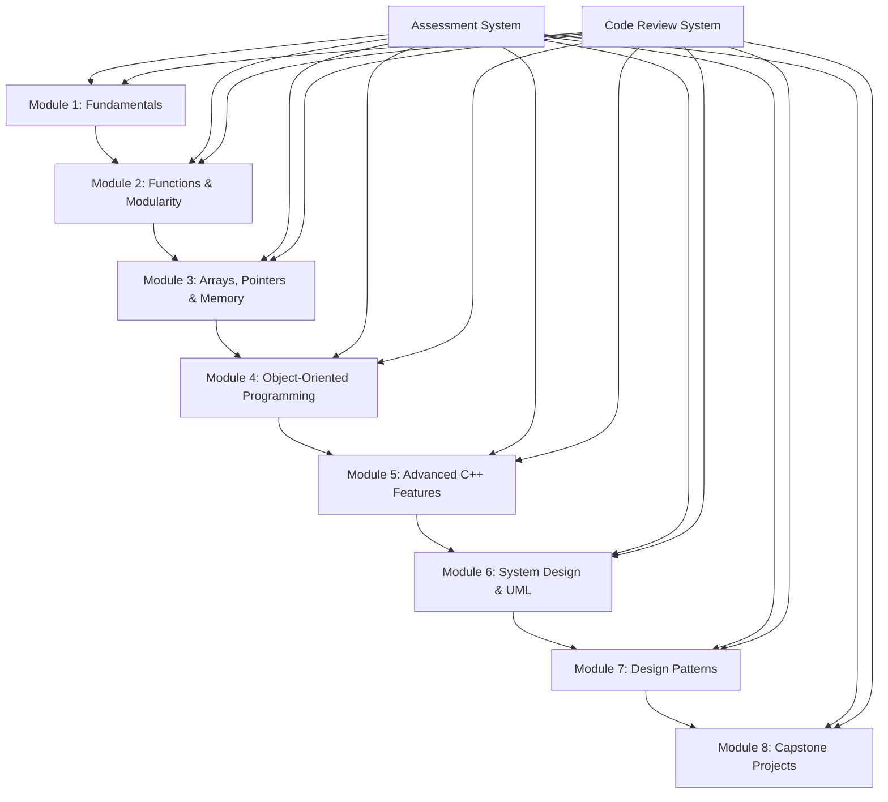

# C++ Learning Curriculum Design Document

## Overview

This design outlines a comprehensive C++ learning curriculum that progresses from basic programming concepts to advanced software engineering practices. The curriculum follows a spiral learning approach where concepts are introduced, practiced, and then revisited at deeper levels throughout the program.

The design emphasizes hands-on learning with immediate practical application, progressive complexity, and real-world project development. Each module builds upon previous knowledge while introducing new concepts in digestible chunks.

## Architecture

### Learning Path Structure



### Module Organization

Each module follows a consistent structure:
- **Theory Introduction**: Core concepts with clear explanations
- **Code Examples**: Annotated examples demonstrating concepts
- **Guided Exercises**: Step-by-step practice problems
- **Independent Practice**: Challenging problems for skill reinforcement
- **Mini-Project**: Practical application combining module concepts
- **Assessment**: Knowledge check and skill evaluation

## Components and Interfaces

### 1. Lesson Content System

**Purpose**: Deliver structured learning content with progressive complexity

**Components**:
- **Concept Explainer**: Interactive explanations with code examples
- **Code Playground**: In-browser C++ compiler for immediate testing
- **Exercise Generator**: Creates practice problems based on current topic
- **Progress Tracker**: Monitors completion and mastery levels

**Interface**:
```cpp
class LessonContent {
public:
    void displayConcept(const std::string& topic);
    void provideExample(const std::string& concept);
    void generateExercise(DifficultyLevel level);
    bool validateSolution(const std::string& code);
    void trackProgress(const std::string& studentId, const std::string& topic);
};
```

### 2. Project Management System

**Purpose**: Guide students through increasingly complex projects

**Components**:
- **Project Templates**: Starter code and requirements for each project
- **Milestone Tracker**: Breaks projects into manageable checkpoints
- **Code Review Engine**: Automated and manual feedback system
- **Portfolio Builder**: Collects completed projects for showcase

**Interface**:
```cpp
class ProjectManager {
public:
    Project createProject(ProjectType type, DifficultyLevel level);
    void setMilestones(const Project& project);
    ReviewResult reviewCode(const std::string& code, const Project& project);
    void updatePortfolio(const std::string& studentId, const Project& project);
};
```

### 3. Assessment and Feedback System

**Purpose**: Evaluate understanding and provide targeted feedback

**Components**:
- **Quiz Engine**: Multiple choice and coding questions
- **Code Analyzer**: Static analysis for common mistakes
- **Performance Metrics**: Tracks learning velocity and retention
- **Adaptive Learning**: Adjusts difficulty based on performance

## Data Models

### Student Progress Model
```cpp
struct StudentProgress {
    std::string studentId;
    std::map<std::string, ModuleProgress> moduleProgress;
    std::vector<Project> completedProjects;
    std::map<std::string, ConceptMastery> conceptMastery;
    LearningMetrics metrics;
};

struct ModuleProgress {
    std::string moduleId;
    float completionPercentage;
    std::vector<std::string> completedLessons;
    std::vector<Exercise> completedExercises;
    AssessmentResult finalAssessment;
};
```

### Curriculum Content Model
```cpp
struct Module {
    std::string moduleId;
    std::string title;
    std::vector<std::string> prerequisites;
    std::vector<Lesson> lessons;
    std::vector<Exercise> exercises;
    Project moduleProject;
    Assessment finalAssessment;
};

struct Lesson {
    std::string lessonId;
    std::string title;
    std::vector<Concept> concepts;
    std::vector<CodeExample> examples;
    std::vector<Exercise> practiceExercises;
};
```

## Module Detailed Design

### Module 1: C++ Fundamentals
- **Duration**: 2-3 weeks
- **Key Topics**: Variables, data types, operators, I/O, control structures
- **Project**: Simple calculator with menu system
- **Assessment**: Basic syntax and logic problems

### Module 2: Functions and Modularity
- **Duration**: 2 weeks  
- **Key Topics**: Function design, overloading, scope, header files
- **Project**: Text processing utility with multiple functions
- **Assessment**: Function design and modular programming

### Module 3: Arrays, Pointers, and Memory Management
- **Duration**: 3 weeks
- **Key Topics**: Static/dynamic arrays, pointer arithmetic, memory allocation
- **Project**: Dynamic data structure (vector implementation)
- **Assessment**: Memory management and pointer manipulation

### Module 4: Object-Oriented Programming
- **Duration**: 4 weeks
- **Key Topics**: Classes, inheritance, polymorphism, virtual functions
- **Project**: Game engine with character hierarchy
- **Assessment**: OOP design and implementation

### Module 5: Advanced C++ Features
- **Duration**: 3 weeks
- **Key Topics**: Templates, STL, exceptions, modern C++ features
- **Project**: Generic container library
- **Assessment**: Template programming and STL usage

### Module 6: System Design and UML
- **Duration**: 2 weeks
- **Key Topics**: UML diagrams, SOLID principles, architecture patterns
- **Project**: System design for a library management system
- **Assessment**: Design documentation and UML creation

### Module 7: Design Patterns
- **Duration**: 3 weeks
- **Key Topics**: Creational, structural, and behavioral patterns
- **Project**: GUI framework implementing multiple patterns
- **Assessment**: Pattern recognition and implementation

### Module 8: Capstone Projects
- **Duration**: 4 weeks
- **Key Topics**: Integration of all concepts
- **Project**: Choose from: Game engine, Database system, or Network application
- **Assessment**: Complete project with documentation and presentation

## Error Handling

### Learning Path Errors
- **Prerequisite Violations**: Prevent access to advanced modules without completing prerequisites
- **Concept Gaps**: Identify and address missing foundational knowledge
- **Progress Stalls**: Provide alternative explanations and additional practice

### Code Compilation Errors
- **Syntax Errors**: Provide clear explanations and suggestions
- **Logic Errors**: Guide debugging process with hints
- **Runtime Errors**: Teach debugging techniques and error prevention

### Assessment Errors
- **Incomplete Submissions**: Allow partial credit and resubmission
- **Plagiarism Detection**: Identify copied code and provide educational response
- **Performance Issues**: Offer additional support and alternative learning paths

## Testing Strategy

### Content Validation
- **Accuracy Testing**: Verify all code examples compile and run correctly
- **Progression Testing**: Ensure smooth difficulty progression between modules
- **Comprehension Testing**: Validate that exercises test intended concepts

### System Testing
- **Load Testing**: Ensure system handles multiple concurrent learners
- **Compatibility Testing**: Verify cross-platform C++ compiler compatibility
- **Performance Testing**: Optimize code compilation and execution times

### Educational Effectiveness
- **Learning Outcome Assessment**: Measure skill acquisition and retention
- **Engagement Metrics**: Track completion rates and time-on-task
- **Feedback Analysis**: Collect and analyze student feedback for improvements

## Implementation Considerations

### Technology Stack
- **Backend**: C++ compiler integration (GCC/Clang)
- **Frontend**: Interactive code editor with syntax highlighting
- **Database**: Student progress and content management
- **Assessment**: Automated testing framework for code evaluation

### Scalability
- **Modular Design**: Each module can be developed and updated independently
- **Content Management**: Easy addition of new exercises and projects
- **Personalization**: Adaptive learning paths based on individual progress

### Accessibility
- **Multiple Learning Styles**: Visual, auditory, and kinesthetic learning support
- **Difficulty Adaptation**: Multiple explanation approaches for different skill levels
- **Progress Flexibility**: Self-paced learning with suggested timelines
